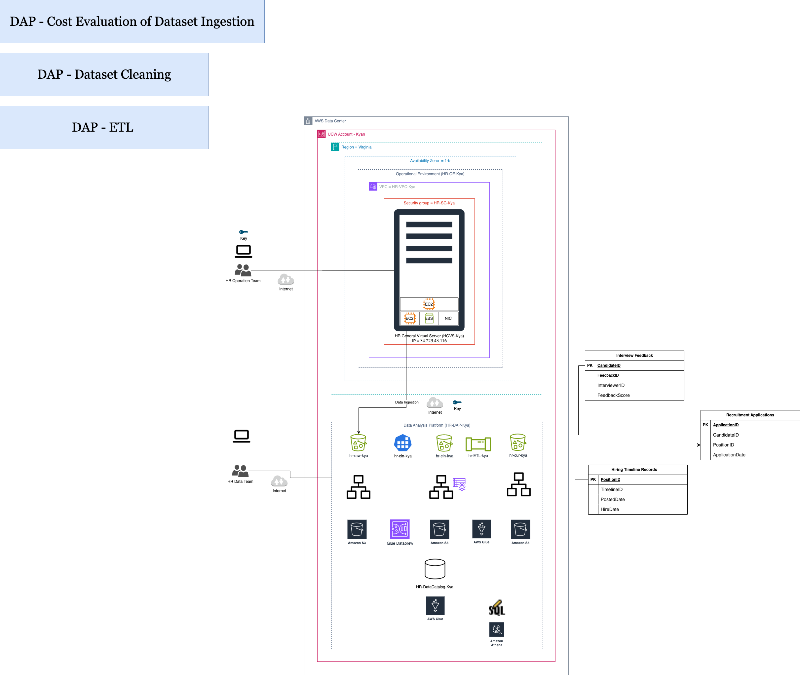
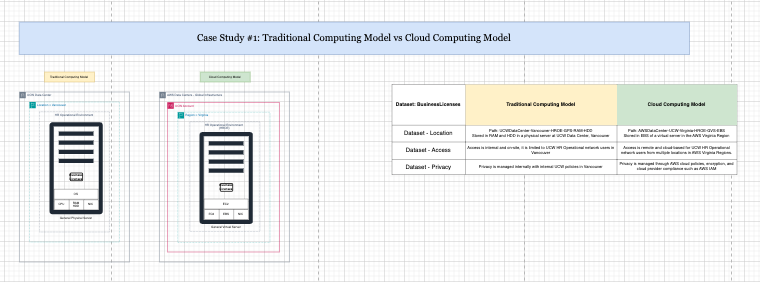

# data-analyst-kyan
# Streamlining the Recruitment Process to Reduce Time-to-Hire

## Project Description
This project is a descriptive analysis of the recruitment process using internal HR datasets. The objective is to identify key factors that contribute to long time-to-hire, uncover bottlenecks in the recruitment pipeline, and generate insights that support strategies to streamline hiring workflows and reduce overall recruitment time.

*Figure 1. ETL workflow of the recruitment process using AWS S3, Glue, DataBrew, and Athena.*

---

## Project Title
**Streamlining the Recruitment Process to Reduce Time-to-Hire**

---

## Objective
The primary goal of this project is to conduct a descriptive analysis of the recruitment process using internal HR datasets. Through this analysis, we aim to identify key factors that contribute to long time-to-hire, uncover bottlenecks in the recruitment pipeline, and generate insights that can support strategies to streamline hiring workflows and reduce overall recruitment time.

---

## Dataset
The dataset includes HR recruitment data collected from the company’s internal systems, focusing on the applicant journey from job posting to hiring. It contains the following three key components:

### Recruitment Applications
- Application ID: Unique identifier for each job application  
- Candidate ID: Identifier for the candidate  
- Position ID: Identifier for the job posting  
- Application Date: Date the application was submitted  

### Interview Feedback
- Feedback ID: Identifier for each feedback entry  
- Candidate ID: Identifier for the interviewed candidate  
- Interviewer ID: Identifier for the interviewer  
- Feedback Score: Quantitative rating of the candidate's performance  

### Hiring Timeline Records
- Timeline ID: Unique identifier for each hiring process record  
- Position ID: Associated job posting  
- Posted Date: Date the job was posted  
- Hire Date: Date the candidate was officially hired  

---

## Methodology

### Data Collection and Preparation
- Loaded the HR datasets (Recruitment Applications, Interview Feedback, and Hiring Timeline Records) using Excel and AWS services such as S3.
- Cleaned and transformed data using AWS Glue DataBrew, including:
  - Removing null values  
  - Trimming whitespace in key fields (e.g., CandidateID, PositionID)  
  - Ensuring correct data types (e.g., converting date fields for calculations)  
  - Removing duplicates and aligning schemas for joins  
- Used Glue Crawlers and the AWS Glue Data Catalog to catalog and prepare datasets for analysis in Athena.

### Descriptive Statistics
Calculated key recruitment performance metrics using Amazon Athena, such as:
- Average time-to-hire across all job postings  
- Time-to-hire by feedback score to reveal candidate quality vs. processing time  
- Predicted time-to-hire after automation  

### Data Visualization
Created visual representations to illustrate findings:
- Draw.io diagram illustrating the ETL pipeline from data ingestion (S3) to final querying in Athena  
- Tables from Athena output showing statistical breakdowns  
- Excel-based charts and tables showing:  
  - Time-to-hire by feedback score  
  - Distribution of applications per position  
  - Summary metrics for each stage of the recruitment process  

### Candidate Segmentation
Segmented candidates based on key behavioral and outcome variables:
- Feedback score tiers (e.g., 1–2, 3–4, 5)  
- Duration of time-to-hire (fast hires vs. delayed)  
- Compared recruitment efficiency across job roles and feedback profiles  
- Identified potential "fast track" patterns based on positive feedback or timing  
- Grouped candidates by feedback score and time-to-hire  
- Analyzed variation across job roles and departments  

---

## Insights and Findings
Key insights derived from Athena query results:
- Feedback score is positively correlated with faster hiring decisions  
- Process delays often occur post-interview, due to missing or delayed feedback  
- Simulated automation (e.g., removing 2 days from the timeline) could significantly reduce average time-to-hire  

---

## Recommendations
Based on findings, the following improvements are recommended:
- Automate repetitive steps such as interview scheduling and follow-ups  
- Enforce time standards for interviewers to submit feedback  
- Use real-time monitoring of time-to-hire metrics in Athena and CloudWatch  
- Implement fast-track protocols for candidates with high feedback scores  

---

## Tools and Technologies

- **AWS S3 (Simple Storage Service)**  
  Used as the central data lake to store raw HR datasets, including recruitment applications, interview feedback, and hiring timeline records. S3 provides scalable, durable storage that integrates seamlessly with other AWS analytics services.

- **AWS Glue & AWS Glue Data Catalog**  
  Employed to automate ETL (Extract, Transform, Load) processes. AWS Glue crawlers and the Glue Data Catalog were used to infer schema, index datasets, and prepare them for querying in Athena.

- **AWS Glue DataBrew**  
  Enabled visual, code-free data preparation. Tasks such as removing null values, standardizing data types (e.g., date formats), deduplicating entries, and cleaning fields (e.g., trimming whitespace in IDs) were handled using DataBrew recipes.

- **AWS Athena**  
  Used to perform SQL-like queries directly on data stored in S3. Athena was essential for calculating performance metrics like average time-to-hire, feedback score distributions, and identifying delays across recruitment stages.

- **Amazon EC2**  
  Provided on-demand compute resources during prototype testing and when running more intensive data transformation scripts that exceeded Glue's interactive limits.

- **Excel**  
  Supplemented AWS services by creating pivot tables, ETL documentation, and summarizing Athena outputs in dashboard-ready formats. Used extensively

---

## AWS Deployment and Service Models  
**Module 1 Case Study – Traditional Computing Model vs. Cloud Computing Model**

### Case Study Summary:
This case study compares the **Traditional On-Premises Computing Model** with the **Cloud Computing Model**, focusing on dataset considerations such as **location, access, and privacy**.

### Visual Overview:
The diagram illustrates two different infrastructure models:
- The **Traditional Computing Model** relies on local, physical servers hosted and managed within a corporate data center.
- The **Cloud Computing Model** leverages shared resources in the AWS Cloud, distributed across Availability Zones and Regions.

The following diagram illustrates the comparison between Traditional and Cloud Computing models:

*Figure 2. Traditional Computing Model vs. Cloud Computing Model (Case Study 1)*

### Dataset Considerations Table:

| **Dataset Consideration** | **Traditional Computing Model**                                                  | **Cloud Computing Model**                                                                 |
|---------------------------|-----------------------------------------------------------------------------------|--------------------------------------------------------------------------------------------|
| **Location**              | Fixed – hosted in a single corporate data center (e.g., on-site Vancouver)       | Flexible – hosted in AWS-managed data centers across Regions (e.g., Canada Central)        |
| **Access**                | Internal access only via VPN, limited to specific devices and personnel          | Role-based access granted to authorized users over the internet via secure protocols       |
| **Privacy**               | Managed manually by internal IT (e.g., physical access control, local encryption)| Managed through AWS IAM, encryption at rest/in transit, and AWS compliance frameworks      |

### Explanation of the Result:
This comparison highlights how AWS cloud services enhance flexibility, scalability, and security in data management. Unlike traditional models that depend on physical hardware and location-specific access, AWS allows organizations to deploy applications globally, scale on demand, and manage identity and access via centralized policies.

**Key benefits of AWS:**
- Global infrastructure across multiple Regions and Availability Zones  
- Elastic provisioning and de-provisioning of compute resources  
- Automation and monitoring tools for improved efficiency  
- Integrated compliance and security standards (e.g., ISO, SOC, GDPR)

This shift reduces reliance on local IT staff for manual updates and security, while also enabling more agile application delivery and disaster recovery planning.

---

## Case Study #2 – Cloud Deployment Models

### Case Study Summary:
This case study explores the four major **cloud deployment models**—**Private Cloud**, **Public Cloud**, **Hybrid Cloud**, and **Multi-Cloud**. Each model is analyzed based on key dataset considerations including **location**, **access**, and **privacy**.

### 🖼 Visual Overview:

*Figure 3. Cloud Deployment Models: Private, Public, Hybrid, and Multi-Cloud*

---

### Dataset Considerations Table

| **Dataset Consideration** | **Private Cloud**                                                              | **Public Cloud**                                                                 | **Hybrid Cloud**                                                                 | **Multi Cloud**                                                                 |
|---------------------------|----------------------------------------------------------------------------------|----------------------------------------------------------------------------------|----------------------------------------------------------------------------------|----------------------------------------------------------------------------------|
| **Location**              | Hosted in the organization’s internal or dedicated environment                  | Hosted in public cloud infrastructure managed by a third-party provider          | Combination of internal servers and public cloud (e.g., AWS and on-premise mix) | Spread across multiple cloud providers and on-premise environments              |
| **Access**                | Limited to internal employees or approved devices; typically VPN-restricted     | Publicly available over the internet with access control                         | Access control split between private and public domains                          | Coordinated access control policies across multiple providers                   |
| **Privacy**               | Full control over data privacy and compliance                                   | Provider ensures compliance (e.g., AWS with SOC, ISO, GDPR)                      | Mixed—requires careful management of data residency and sync                    | Complex compliance due to multiple jurisdictions; requires strong coordination  |

---

### Explanation of the Result:
The comparison between Private Cloud, Public Cloud, Hybrid Cloud, and Multi-Cloud models demonstrates the strategic considerations organizations must evaluate when selecting a cloud deployment model. Each model provides varying levels of control, scalability, cost-efficiency, and complexity:

- **Private Cloud** is suited for highly regulated industries or organizations handling sensitive data that must remain within controlled environments. It provides maximum control and security but incurs higher capital and operational costs due to dedicated infrastructure.

- **Public Cloud** enables organizations to quickly scale and access cost-effective computing power without owning infrastructure. This model is ideal for startups, agile development environments, or non-sensitive workloads. However, organizations must rely on shared responsibility models for security and governance.

- **Hybrid Cloud** offers flexibility by combining the benefits of both private and public clouds. It allows sensitive data or legacy systems to remain on-premise while leveraging the cloud for scalability and innovation. This model is common in enterprises transitioning to cloud-native environments while still maintaining core systems.

- **Multi-Cloud** deployment is often driven by the need for redundancy, vendor diversification, or specialized service availability across providers (e.g., AWS, Azure, GCP). It enhances fault tolerance and avoids vendor lock-in but increases operational complexity due to the need to manage multiple platforms, APIs, and compliance policies.

This analysis highlights how AWS, as part of public, hybrid, or multi-cloud environments, can support organizations in aligning their IT strategy with business priorities — such as compliance, scalability, disaster recovery, and cost optimization.

