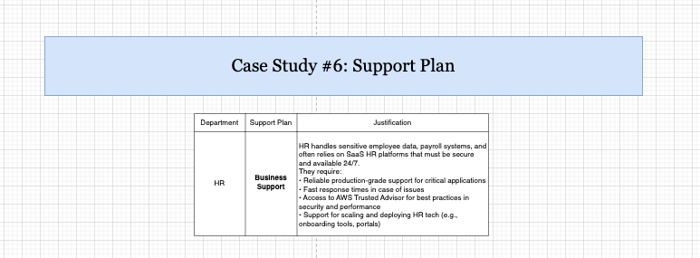

# data-analyst-kyan
# Streamlining the Recruitment Process to Reduce Time-to-Hire

## Project Description
This project is a descriptive analysis of the recruitment process using internal HR datasets. The objective is to identify key factors that contribute to long time-to-hire, uncover bottlenecks in the recruitment pipeline, and generate insights that support strategies to streamline hiring workflows and reduce overall recruitment time.


*Figure 1. ETL workflow of the recruitment process using AWS S3, Glue, DataBrew, and Athena.*

---

## Project Title
**Streamlining the Recruitment Process to Reduce Time-to-Hire**

---

## Objective
The primary goal of this project is to conduct a descriptive analysis of the recruitment process using internal HR datasets. Through this analysis, we aim to identify key factors that contribute to long time-to-hire, uncover bottlenecks in the recruitment pipeline, and generate insights that can support strategies to streamline hiring workflows and reduce overall recruitment time.

---

## Dataset
The dataset includes HR recruitment data collected from the company’s internal systems, focusing on the applicant journey from job posting to hiring. It contains the following three key components:

### Recruitment Applications
- Application ID: Unique identifier for each job application  
- Candidate ID: Identifier for the candidate  
- Position ID: Identifier for the job posting  
- Application Date: Date the application was submitted  

### Interview Feedback
- Feedback ID: Identifier for each feedback entry  
- Candidate ID: Identifier for the interviewed candidate  
- Interviewer ID: Identifier for the interviewer  
- Feedback Score: Quantitative rating of the candidate's performance  

### Hiring Timeline Records
- Timeline ID: Unique identifier for each hiring process record  
- Position ID: Associated job posting  
- Posted Date: Date the job was posted  
- Hire Date: Date the candidate was officially hired  

---

## Methodology

### Data Collection and Preparation
- Loaded the HR datasets (Recruitment Applications, Interview Feedback, and Hiring Timeline Records) using Excel and AWS services such as S3.
- Cleaned and transformed data using AWS Glue DataBrew, including:
  - Removing null values  
  - Trimming whitespace in key fields (e.g., CandidateID, PositionID)  
  - Ensuring correct data types (e.g., converting date fields for calculations)  
  - Removing duplicates and aligning schemas for joins  
- Used Glue Crawlers and the AWS Glue Data Catalog to catalog and prepare datasets for analysis in Athena.

### Descriptive Statistics
Calculated key recruitment performance metrics using Amazon Athena, such as:
- Average time-to-hire across all job postings  
- Time-to-hire by feedback score to reveal candidate quality vs. processing time  
- Predicted time-to-hire after automation  

### Data Visualization
Created visual representations to illustrate findings:
- Draw.io diagram illustrating the ETL pipeline from data ingestion (S3) to final querying in Athena  
- Tables from Athena output showing statistical breakdowns  
- Excel-based charts and tables showing:  
  - Time-to-hire by feedback score  
  - Distribution of applications per position  
  - Summary metrics for each stage of the recruitment process  

### Candidate Segmentation
Segmented candidates based on key behavioral and outcome variables:
- Feedback score tiers (e.g., 1–2, 3–4, 5)  
- Duration of time-to-hire (fast hires vs. delayed)  
- Compared recruitment efficiency across job roles and feedback profiles  
- Identified potential "fast track" patterns based on positive feedback or timing  
- Grouped candidates by feedback score and time-to-hire  
- Analyzed variation across job roles and departments  

---

## Insights and Findings
Key insights derived from Athena query results:
- Feedback score is positively correlated with faster hiring decisions  
- Process delays often occur post-interview, due to missing or delayed feedback  
- Simulated automation (e.g., removing 2 days from the timeline) could significantly reduce average time-to-hire  

---

## Recommendations
Based on findings, the following improvements are recommended:
- Automate repetitive steps such as interview scheduling and follow-ups  
- Enforce time standards for interviewers to submit feedback  
- Use real-time monitoring of time-to-hire metrics in Athena and CloudWatch  
- Implement fast-track protocols for candidates with high feedback scores  

---

## Tools and Technologies

- **AWS S3 (Simple Storage Service)**  
  Used as the central data lake to store raw HR datasets, including recruitment applications, interview feedback, and hiring timeline records. S3 provides scalable, durable storage that integrates seamlessly with other AWS analytics services.

- **AWS Glue & AWS Glue Data Catalog**  
  Employed to automate ETL (Extract, Transform, Load) processes. AWS Glue crawlers and the Glue Data Catalog were used to infer schema, index datasets, and prepare them for querying in Athena.

- **AWS Glue DataBrew**  
  Enabled visual, code-free data preparation. Tasks such as removing null values, standardizing data types (e.g., date formats), deduplicating entries, and cleaning fields (e.g., trimming whitespace in IDs) were handled using DataBrew recipes.

- **AWS Athena**  
  Used to perform SQL-like queries directly on data stored in S3. Athena was essential for calculating performance metrics like average time-to-hire, feedback score distributions, and identifying delays across recruitment stages.

- **Amazon EC2**  
  Provided on-demand compute resources during prototype testing and when running more intensive data transformation scripts that exceeded Glue's interactive limits.

- **Excel**  
  Supplemented AWS services by creating pivot tables, ETL documentation, and summarizing Athena outputs in dashboard-ready formats. Used extensively

---

# AWS Module 1 – Cloud Fundamentals

## Visual Summary of Module 1

The image below summarizes all core concepts from Module 1, including:

- Key cloud computing concepts
- Case Study #1: Traditional vs. Cloud Computing Model
- Case Study #2: Cloud Deployment Models
- Case Study #3: Cloud Service Models
- Knowledge Check 


*Figure 2: Summary of AWS Module 1 with concepts, case studies (Traditional vs. Cloud Computing, Cloud Deployment Models, Cloud Service Models), and knowledge check results.*

## AWS Deployment and Service Models  
**Module 1 Case Study – Traditional Computing Model vs. Cloud Computing Model**

### Case Study Summary:
This case study compares the **Traditional On-Premises Computing Model** with the **Cloud Computing Model**, focusing on dataset considerations such as **location, access, and privacy**.

### Visual Overview:
The diagram illustrates two different infrastructure models:
- The **Traditional Computing Model** relies on local, physical servers hosted and managed within a corporate data center.
- The **Cloud Computing Model** leverages shared resources in the AWS Cloud, distributed across Availability Zones and Regions.

The following diagram illustrates the comparison between Traditional and Cloud Computing models:


*Figure 3. Traditional Computing Model vs. Cloud Computing Model (Case Study 1)*

### Dataset Considerations Table:

| **Dataset Consideration** | **Traditional Computing Model**                                                  | **Cloud Computing Model**                                                                 |
|---------------------------|-----------------------------------------------------------------------------------|--------------------------------------------------------------------------------------------|
| **Location**              | Fixed – hosted in a single corporate data center (e.g., on-site Vancouver)       | Flexible – hosted in AWS-managed data centers across Regions (e.g., Canada Central)        |
| **Access**                | Internal access only via VPN, limited to specific devices and personnel          | Role-based access granted to authorized users over the internet via secure protocols       |
| **Privacy**               | Managed manually by internal IT (e.g., physical access control, local encryption)| Managed through AWS IAM, encryption at rest/in transit, and AWS compliance frameworks      |

### Explanation of the Result:
This comparison highlights how AWS cloud services enhance flexibility, scalability, and security in data management. Unlike traditional models that depend on physical hardware and location-specific access, AWS allows organizations to deploy applications globally, scale on demand, and manage identity and access via centralized policies.

**Key benefits of AWS:**
- Global infrastructure across multiple Regions and Availability Zones  
- Elastic provisioning and de-provisioning of compute resources  
- Automation and monitoring tools for improved efficiency  
- Integrated compliance and security standards (e.g., ISO, SOC, GDPR)

This shift reduces reliance on local IT staff for manual updates and security, while also enabling more agile application delivery and disaster recovery planning.

## Case Study #2 – Cloud Deployment Models

### Case Study Summary:
This case study explores the four major **cloud deployment models**—**Private Cloud**, **Public Cloud**, **Hybrid Cloud**, and **Multi-Cloud**. Each model is analyzed based on key dataset considerations, including **location**, **access**, and **privacy**.

### Visual Overview:


*Figure 4. Cloud Deployment Models: Private, Public, Hybrid, and Multi-Cloud*

### Dataset Considerations Table

| **Dataset Consideration** | **Private Cloud**                                                              | **Public Cloud**                                                                 | **Hybrid Cloud**                                                                 | **Multi Cloud**                                                                 |
|---------------------------|----------------------------------------------------------------------------------|----------------------------------------------------------------------------------|----------------------------------------------------------------------------------|----------------------------------------------------------------------------------|
| **Location**              | Hosted in the organization’s internal or dedicated environment                  | Hosted in public cloud infrastructure managed by a third-party provider          | Combination of internal servers and public cloud (e.g., AWS and on-premise mix) | Spread across multiple cloud providers and on-premise environments              |
| **Access**                | Limited to internal employees or approved devices; typically VPN-restricted     | Publicly available over the internet with access control                         | Access control split between private and public domains                          | Coordinated access control policies across multiple providers                   |
| **Privacy**               | Full control over data privacy and compliance                                   | Provider ensures compliance (e.g., AWS with SOC, ISO, GDPR)                      | Mixed—requires careful management of data residency and sync                    | Complex compliance due to multiple jurisdictions; requires strong coordination  |

### Explanation of the Result:
The comparison between Private Cloud, Public Cloud, Hybrid Cloud, and Multi-Cloud models demonstrates the strategic considerations organizations must evaluate when selecting a cloud deployment model. Each model provides varying levels of control, scalability, cost-efficiency, and complexity:

- **Private Cloud** is suited for highly regulated industries or organizations handling sensitive data that must remain within controlled environments. It provides maximum control and security but incurs higher capital and operational costs due to dedicated infrastructure.

- **Public Cloud** enables organizations to quickly scale and access cost-effective computing power without owning infrastructure. This model is ideal for startups, agile development environments, or non-sensitive workloads. However, organizations must rely on shared responsibility models for security and governance.

- **Hybrid Cloud** offers flexibility by combining the benefits of both private and public clouds. It allows sensitive data or legacy systems to remain on-premise while leveraging the cloud for scalability and innovation. This model is common in enterprises transitioning to cloud-native environments while still maintaining core systems.

- **Multi-Cloud** deployment is often driven by the need for redundancy, vendor diversification, or specialized service availability across providers (e.g., AWS, Azure, GCP). It enhances fault tolerance and avoids vendor lock-in but increases operational complexity due to the need to manage multiple platforms, APIs, and compliance policies.

This analysis highlights how AWS, as part of public, hybrid, or multi-cloud environments, can support organizations in aligning their IT strategy with business priorities, such as compliance, scalability, disaster recovery, and cost optimization.

## Case Study #3 – Cloud Service Models

This case study explores the three primary cloud service models—**IaaS (Infrastructure as a Service), PaaS (Platform as a Service), and SaaS (Software as a Service)**—and how they affect an organization’s control over data, infrastructure, access, and privacy.

### Visual Overview:


*Figure 5: Comparison of Cloud Service Models based on location, access, and privacy.*

### Dataset Considerations:

| Dataset Consideration | IaaS                                                                 | PaaS                                                                 | SaaS                                                                 |
|-----------------------|----------------------------------------------------------------------|----------------------------------------------------------------------|----------------------------------------------------------------------|
| **Location**          | Data hosted in AWS-managed infrastructure (e.g., EC2 in Canada Central). HR datasets are stored in Amazon S3 and processed through Glue. | Hosted on managed infrastructure using AWS Elastic Beanstalk. HR datasets are stored in S3 and accessed via Glue and Athena. | Fully hosted in vendor-managed infrastructure (e.g., Workday, Office 365). Data location governed by vendor’s cloud policy. |
| **Access**            | Access via IAM roles and EC2 CLI by the HR operations team. Secured using encryption and security groups. | Access through deployment and monitoring consoles. IAM-based role management still applies. | Users access SaaS through a web UI or app. Admins manage access via role assignments and service settings. |
| **Privacy**           | Full responsibility lies with the client. The HR team manages IAM, KMS, security groups, encryption, and auditing. | Privacy is a shared responsibility. AWS manages the infrastructure, while users control the app layer and access. | Vendor manages most privacy concerns. HR operations define access roles but rely on the vendor’s internal compliance framework. |

### Explanation of the Result:

This case study highlights the **trade-offs between control, responsibility, and convenience** in cloud service delivery:

- **IaaS (Infrastructure as a Service)** offers the **most control and flexibility**. HR departments must manage the full stack—from networking and security to storage and compute. This model is ideal for custom applications requiring fine-tuned infrastructure settings and deeper data control.

- **PaaS (Platform as a Service)** simplifies infrastructure management by offering pre-configured development environments. This enables developers and HR analysts to **focus on business logic** and application development without worrying about the underlying OS or server setup. It’s best for teams needing speed and reduced operational overhead.

- **SaaS (Software as a Service)** provides **fully managed software solutions**. This is ideal for non-technical HR teams needing quick access to tools like payroll, performance tracking, or employee management without building or maintaining applications. However, **control over data privacy and residency is limited** to the provider's compliance frameworks.

By analyzing service models this way, organizations can make informed decisions depending on their regulatory environment, budget, and technical expertise.

## Module 1 Knowledge Check


*Figure 6: AWS Academy Cloud Foundations Module 1 Knowledge Check Results.*

---

# AWS Module 2 – Cloud Economics and Billing

## Visual Summary of Module 2

The following figure consolidates key concepts and case studies from Module 2, including:

- AWS pricing principles and TCO analysis
- Cost optimization strategies
- AWS Support plans and pricing calculator exercises


*Figure 7: Summary of AWS Module 2 with concepts, case studies (Delaware North, Pricing Calculator, Support Plan), and knowledge check results.*

### Case Study #4: Total Cost of Ownership (TCO) – Delaware North

** Company Overview**:  
Delaware North is a large global hospitality company operating in 200+ locations, serving over 500 million customers annually with $3B in revenue.

** Problem**:  
They were facing aging, costly on-premises infrastructure and increasing pressure to rapidly deploy scalable digital solutions.

** Objectives**:
- Replace outdated hardware with cloud infrastructure.
- Reduce operational costs.
- Improve agility and provisioning time.
- Justify investment with a positive ROI.

** Solution Implemented**:
- Migrated 205 servers and nearly all applications to AWS.
- Adopted 3-year EC2 Reserved Instances for predictable cost savings.
- Retained 20 local servers for specialized tasks.

** Outcome**:
- Saved $3.5M over five years.
- Reduced provisioning time from 2–3 weeks to just 1 day.
- Enhanced disaster recovery capabilities, data security, and overall agility.

** Result Explanation**:  
By using AWS, Delaware North achieved a scalable, flexible, and more cost-effective IT environment. Reserved Instances helped reduce cost predictability, while cloud-based deployments enabled rapid time-to-value for new services.

  
*Figure 8: Delaware North used AWS to modernize its IT infrastructure and reduce cost.*

### Case Study #5: AWS Pricing Calculator

** Objective**:  
Teams simulated cloud cost forecasts using the AWS Pricing Calculator across three workload scenarios:  
1. **Data Storage**  
2. **Data Profiling and Cleaning**  
3. **Data Analysis**

** Approach & Insights**:
- **Data Storage**:  
  - Used Amazon S3 with moderate storage demand.
  - Forecasted cost was minimal due to S3’s cost-efficient pricing and durability.

- **Data Profiling & Cleaning**:  
  - Used AWS Glue DataBrew and storage with higher processing power.
  - Moderate compute usage raised costs slightly.

- **Data Analysis**:  
  - Used EC2 and data processing/storage at scale.
  - Incurred the highest cost due to extended compute times and traffic.

** Result Explanation**:  
Each scenario provided valuable insight into the monthly cost and resource usage expectations. The pricing calculator enabled better budgeting, workload comparison, and identification of cost drivers, empowering each team to optimize their AWS architecture before deployment.

  
*Figure 9: Sample outputs of cost estimation across different use cases.*

### Case Study #6: AWS Support Plan

**Department Analyzed**: Human Resources (HR)

** Support Needs**:
- 24/7 access to payroll and employee data platforms (SaaS).
- Quick response to technical issues.
- Reliable infrastructure to scale during peak onboarding/offboarding periods.
- Access to best-practice guidance and billing support.

** Selected Plan**: **Business Support**

** Justification**:
- Includes AWS Trusted Advisor for continuous optimization.
- Provides access to Cloud Support Engineers for technical help.
- Covers guidance for architecture, cost control, and scaling.
- Enables support for critical systems at production scale.

** Result Explanation**:  
The Business Support plan strikes a balance between cost and comprehensive support. It allows HR to maintain high service availability, reduce downtime risk, and gain operational insight through AWS tools—all essential for a department that manages sensitive employee information.

  
*Figure 10: HR’s needs are best matched by the AWS Business Support plan.*

### Module 2 Knowledge Check

Successfully completed the AWS Module 2 knowledge check.

  
*Figure 11: Full marks achieved for Module 2 review.*

---

# AWS Module 3 – Global Infrastructure and Service Categories

## Visual Summary of Module 3

The following figure consolidates the key concepts and case studies from Module 3, including:

- AWS Global Infrastructure: Regions, Availability Zones, Edge Locations
- Latency and access optimization using Edge services
- Case-based data privacy and architecture mapping


*Figure 12: Summary of AWS Module 3 with global architecture layers, access models, and case study analysis.*


### Case Study #7: AWS Global Infrastructure

** Use Case Summary**:  
An organization needs to store and access HR-related business license data securely while also providing fast, global access to public content for students.

** Infrastructure Strategy**:  
The organization leveraged different AWS layers to serve distinct users:

1. **Regional Edge Cache** (Seattle):  
   - Passive caching of data for quick reference.
   - No user interaction; used for storage optimization.

2. **Edge Location** (Vancouver):  
   - Fast delivery of cached, non-sensitive content to students.
   - Latency minimized using local edge access.

3. **Region** (e.g., Oregon or Canada Central):  
   - Full access and secure storage for HR staff.
   - Protected by IAM policies, encryption, and availability zones.

** Result Explanation**:  
This case highlights how AWS infrastructure supports performance and privacy needs simultaneously. Cached content enables fast, low-cost global delivery for non-sensitive data, while Regions enforce the highest level of control and compliance for internal users.

| Dataset Consideration | Regional Edge Cache | Edge Location | Region |
|------------------------|---------------------|---------------|--------|
| **Location** | Cached in Seattle | Accessed via Vancouver | Stored in Oregon or Canada Central |
| **Access**   | No direct access required | Students retrieve content from cache | Full access for HR team |
| **Privacy**  | No privacy enforcement | Medium (anonymous user access) | High (IAM, encryption, compliance) |

  
*Figure 13: Architecture layout for different access tiers using AWS infrastructure.*

### Module 3 Knowledge Check

  
*Figure 14: Full marks achieved for Module 3 review.*

---

# AWS Module 4 – Security, Responsibility, and Identity Access Management (IAM)

## Visual Summary of Module 4

The following figure consolidates key concepts and case studies from Module 4, including:

- AWS Shared Responsibility Model  
- Identity and Access Management (IAM) roles, groups, and policies  
- Hands-on IAM permissions setup in a guided lab environment

  
*Figure 15: Overview of key concepts, shared responsibilities, and IAM practice from AWS Module 4.*

### Case Study #8: Who Is Responsible?

**Scenario Summary**:  
An HR department stores a business license dataset on AWS and wants to clarify which responsibilities lie with AWS and which with the customer (UCW). The system uses EC2 in an AWS-managed environment.

**Shared Responsibility Matrix**:

| Component  | UCW Responsibility                                         | AWS Responsibility                                              |
|------------|------------------------------------------------------------|-----------------------------------------------------------------|
| **EC2**     | ❌ No control                                              | ✅ Full responsibility for infrastructure & EC2 instance security |
| **Platform** | ❌ No control                                              | ✅ Maintains platform functionality (OS, virtualization, etc.)    |
| **Software** | ✅ Manages business app (e.g., license mgmt software)     | ❌ No responsibility for third-party app code                    |
| **Dataset**  | ✅ Owns and protects dataset integrity and access         | ❌ No access or responsibility for dataset content               |

**Result Explanation**:  
This case reinforces the AWS Shared Responsibility Model. While AWS secures the cloud infrastructure, the customer must manage anything they put into the cloud, including app configuration, data governance, and access control.

  
*Figure 16: AWS handles infrastructure, while customers manage their own apps and data.*

### Case Study #9: IAM Practice – Lab 1

**Objective**:  
To demonstrate the practical application of IAM principles by assigning users to groups with specific permissions and testing access scenarios in a sandbox AWS environment.

**Steps Completed**:

1. **Initial IAM Setup Review**:
   - Users (`user-1`, `user-2`, `user-3`) were created with no permissions initially.
   - Groups with defined policies:  
     - `S3-Support` → AmazonS3ReadOnlyAccess  
     - `EC2-Support` → AmazonEC2ReadOnlyAccess  
     - `EC2-Admin` → Inline policy for EC2 Start/Stop

2. **Group Assignments**:
   - `user-1` assigned to `S3-Support` → Read-only access to Amazon S3.
   - `user-2` assigned to `EC2-Support` → Read-only access to EC2.
   - `user-3` assigned to `EC2-Admin` → View, Start, Stop EC2 instances.

3. **Testing IAM Sign-In and Permissions**:
   - Logged in as each user using the IAM sign-in URL.
   - Verified that:
     - `user-1` could view S3 buckets but not EC2.
     - `user-2` could view EC2 instances but couldn’t stop them, and couldn’t access S3.
     - `user-3` could start/stop EC2 instances.

**Result Explanation**:  
The lab validated the correct use of IAM groups and policies to enforce role-based access control (RBAC). Users only accessed services relevant to their role, confirming that IAM security boundaries were respected and correctly enforced.

  
*Figure 17: IAM users grouped by access level to ensure secure and limited operations across services.*


### Module 4 Knowledge Check

Achieved a perfect score on the AWS Module 4 knowledge check.

  
*Figure 18: Full marks achieved for Module 4 review.*

---
# AWS Module 5 – Networking and Content Delivery

## Visual Summary of Module 5

The following figure summarizes key networking and content delivery concepts covered in Module 5, including:

- VPC architecture and subnetting  
- Network ACLs and security groups  
- CloudFront, Route 53, and EC2 web server deployment

  
*Figure 15: Overview of AWS networking services with section-wise concept breakdown and practical lab implementation.*

### Case Study #10: Build Your VPC – Lab 2

**Objective**:  
Design and deploy a secure and scalable network architecture using **Amazon VPC**. This lab required setting up a multi-AZ VPC, creating subnets, route tables, a security group, and launching a web server via an EC2 instance.

**Architecture Breakdown**:

1. **Task 1 – Create VPC and Subnets**:
   - Created a VPC using the *VPC and more* wizard.
   - Defined IPv4 CIDR block: `10.0.0.0/16`
   - Set up public subnet: `10.0.0.0/24` and private subnet: `10.0.1.0/24`
   - Provisioned:
     - Internet Gateway (IGW)
     - NAT Gateway for private subnet internet access
     - Separate route tables for public and private subnets

2. **Task 2 – Expand Availability**:
   - Added two additional subnets in a second AZ:
     - Public Subnet 2: `10.0.2.0/24`
     - Private Subnet 2: `10.0.3.0/24`
   - Associate them with existing route tables for high availability.

3. **Task 3 – Configure Security**:
   - Created a **Security Group**: “Web Security Group”
     - Inbound rule: Allow HTTP traffic from anywhere (IPv4)
   - Enabled safe access for web hosting on the EC2 instance.

4. **Task 4 – Launch Web Server**:
   - Launched an EC2 instance (`t2.micro`) into the public subnet.
   - Assigned a public IPv4 and attached the Web Security Group.
   - Used a startup script to:
     - Install Apache, PHP, and MariaDB
     - Download and unzip the lab application
     - Start the web server

**Result**:  
- Successfully launched a fully functional web server accessible via the public DNS.  
- The setup reflects production-grade architecture with security layers (private subnets, NAT, SGs) and scalability across AZs.

**Lab Assessment**:  
- Scored a perfect **30/30**:
  - All subnets, routes, security rules, and EC2 configurations validated and functional.

  
*Figure 16: EC2 and VPC deployment walkthrough, showing full lab completion and architecture setup.*

### Module 5 Knowledge Check

  
*Figure 17: Full marks achieved for Module 5 assessment.*

---

# AWS Module 6 – Compute Services

## Visual Summary of Module 6

The following figure summarizes key compute concepts covered in Module 6, including:

- Amazon EC2 instance types and purchasing models  
- EC2 cost optimization strategies  
- AWS Lambda and serverless architecture  
- Container services (ECS, EKS) and Elastic Beanstalk deployment options  

  
*Figure 18: Overview of AWS compute services with section-wise concept breakdown and practical lab implementation.*

### Case Study #11: Create an AWS Lambda Function

**Objective**:  
Implement an AWS Lambda function that automatically stops an EC2 instance using a scheduled Amazon EventBridge rule. This lab introduces event-driven automation in a serverless environment.

**Architecture Breakdown**:

1. **Task 1 – Create Lambda Function**:
   - Created a function named `myStopinator` using Python 3.11
   - Assigned an existing IAM role `myStopinatorRole` to allow EC2 instance control

2. **Task 2 – Configure Scheduled Trigger**:
   - Added a trigger via Amazon EventBridge
   - Rule created: `everyMinute` with schedule expression `rate(1 minute)`
   - Ensures function is triggered automatically every 60 seconds

3. **Task 3 – Add and Deploy Code**:
   - Replaced placeholder region and instance ID in the provided Python script:
     ```python
     import boto3
     region = 'us-east-1'  # Replace with actual region
     instances = ['i-0123456789abcdef0']  # Replace with actual instance ID
     ec2 = boto3.client('ec2', region_name=region)

     def lambda_handler(event, context):
         ec2.stop_instances(InstanceIds=instances)
         print('stopped your instances: ' + str(instances))
     ```
   - Saved and deployed the function using the Lambda console
   - Verified function execution logs and status via the **Monitor** tab

4. **Task 4 – Validate Automation**:
   - Confirmed EC2 instance was stopped as expected
   - Lambda function re-executed successfully every minute
   - Manual start of the instance was overridden by the next trigger execution

**Result**:  
- Successfully built a fully functional Lambda-based automation pipeline  
- Demonstrated effective use of serverless compute and event-driven services  
- Scored a perfect **20/20** on lab assessment

  
*Figure 19: Lambda deployment and EC2 shutdown automation validated across all tasks.*

### Module 6 Knowledge Check

  
*Figure 20: Full marks achieved for Module 6 assessment.*

---

# AWS Module 7 – Storage and Databases

## Visual Summary of Module 7

The following figure highlights major concepts and implementation practices from Module 7, including:

- Amazon EBS lifecycle and snapshot strategy  
- EFS and Glacier storage models  
- S3 tiering, bucket policy, and database storage options  

  
*Figure 18: Overview of Module 7 topics such as EBS, EFS, S3, Glacier, and related use cases.*

### Case Study #12: Working with Amazon EBS – Lab 4

**Objective**:  
Demonstrate full use of **Amazon Elastic Block Store (EBS)** by creating, attaching, formatting, snapshotting, and restoring an EBS volume connected to an EC2 instance.

**Tasks Completed**:

1. **Create EBS Volume**  
   - Type: General Purpose SSD (gp2)  
   - Size: 1 GiB  
   - Zone: Same as EC2 instance  
   - Tagged as: `My Volume`

2. **Attach Volume to EC2**  
   - Attached using `/dev/sdf`  
   - Verified attachment through the EC2 console  

3. **Mount Volume on EC2 Instance**  
   - Used EC2 Instance Connect  
   - Formatted volume with `ext3`  
   - Mounted at `/mnt/data-store`  
   - Configured `/etc/fstab` for persistence  
   - Wrote file (`file.txt`) to volume

4. **Create Snapshot**  
   - Created `My Snapshot` from the 1 GiB volume  
   - Verified successful snapshot in EC2 console  
   - Deleted the file to simulate data loss

5. **Restore Snapshot to New Volume**  
   - Created new volume from snapshot  
   - Attached as `/dev/sdg`  
   - Mounted at `/mnt/data-store2`  
   - Verified restored file exists (`file.txt` found)

**Result**:  
All operations were successful. The lab showcased EBS best practices—demonstrating persistence, backup, and recovery at the volume level. The restored file validated that snapshot-based disaster recovery works seamlessly.

  
*Figure 19: Screenshot of completed EBS lab with full score and attached lifecycle diagram.*

### Module 7 Knowledge Check

  
*Figure 20: Full marks achieved for Module 7 assessment.*
